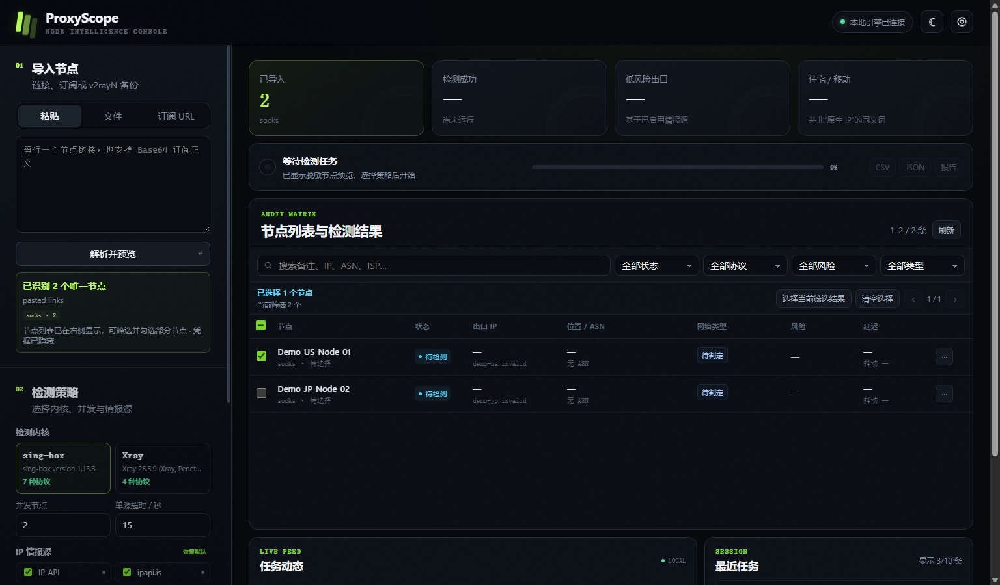
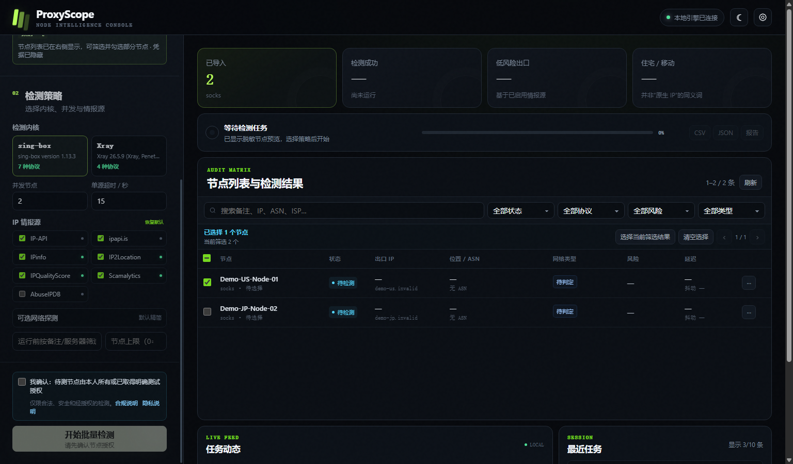
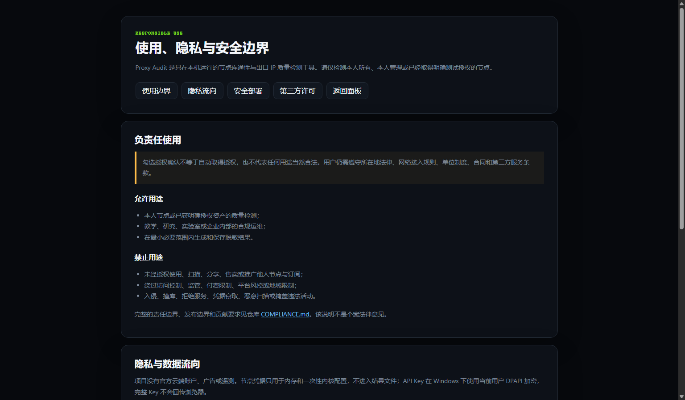
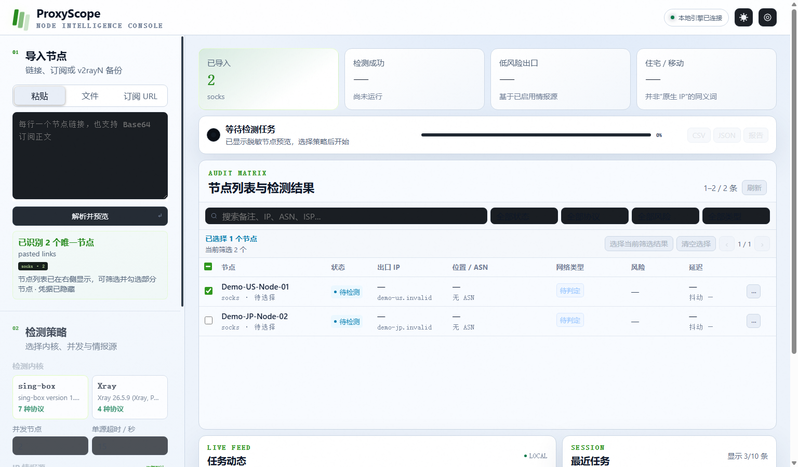

# Proxy Audit

[简体中文](README.md) | [English](README_EN.md)

[](LICENSE)
[](https://github.com/zouchenzhen/proxy-audit/actions/workflows/security-and-tests.yml)

Windows 11 下的代理节点批量检测工具。目标是从 v2rayN 备份 / 数据库 / 分享链接中读取节点，使用 sing-box 建立本地代理并真实出站测试，查询出口 IP 的多源情报，最后输出可读报表。

> [!IMPORTANT]
> 请仅检测本人所有、本人管理或已经取得明确测试授权的节点，并遵守所在地法律法规及第三方服务条款。项目不是节点提供商，不提供公共代理、绕过访问控制或匿名保证。使用前请阅读[负责任使用说明](COMPLIANCE.md)和[隐私说明](PRIVACY.md)。

治理与发布文档：[Security Policy](SECURITY.md) · [第三方许可](THIRD_PARTY_NOTICES.md) · [品牌使用](TRADEMARKS.md) · [公开发布检查清单](docs/PUBLIC_RELEASE_CHECKLIST.md) · [Apache-2.0](LICENSE)

## 在线演示（即将开放）

在线地址（暂未开放）：[https://zouchenzhen-zcz.hf.space](https://zouchenzhen-zcz.hf.space)

> [!NOTE]
> 我正在开发一个无需安装、打开浏览器即可使用的在线演示版。完成稳定性和隐私验收后，
> 我会在这里更新开放状态；现在请先使用下方本地版。

在线演示版开放后，页面和检测后端将位于同一个临时云端环境。同意隐私提示后，每个浏览器
标签页会创建一个匿名临时会话，节点、订阅、API Key、任务和结果会上传到临时后端处理。

- 数据只保存在单进程内存和任务期临时文件，不写入数据库或项目历史；会话最长一小时；
- 到期或点击“立即取消并删除会话”会立即使会话失效并触发取消与清理；已经开始的单次
  网络请求可能等待最长 12 秒超时后释放；
- Space 重启、休眠或重新部署会丢失所有会话，请检测结束后立即导出；
- 每次导入/单任务最多 20 个节点、并发最多 2、同一网络每日最多 100 个节点；
- Hugging Face、订阅服务器、IP 情报商和测试端点仍会处理完成请求所必需的数据。高敏感、
  大批量或需要持久历史的场景请使用下方本地版。

完整边界见[隐私说明](PRIVACY.md)。在线演示正式开放前，这些规则仍可能根据实际验收结果
调整；开放时会同步更新文档。云端镜像分发的固定版本内核许可证与对应源码归档将通过
在线站点的 `/third-party/` 路径提供。

IPinfo、IP2Location、IPQualityScore、Scamalytics、AbuseIPDB 等服务的 Key 可在各自官网
自行注册获取。它们的免费额度通常已经足够个人低频检测；具体额度和条款以服务商官网
当前说明为准。无需 Key 的情报源也可以直接使用。

## 本地 Web UI（高敏感/大批量推荐）

克隆后双击项目根目录的 `start-web.cmd` 即可。首次启动会自动创建 `.venv`、安装 Python 依赖，并在缺少检测内核时从 sing-box 官方发行页下载经过 SHA256 校验的固定版本：

```powershell
git clone https://github.com/zouchenzhen/proxy-audit.git
cd proxy-audit
.\start-web.cmd
```

也可以在 PowerShell 中运行：

```powershell
cd proxy-audit
./start-web.ps1
```

浏览器会打开 `http://127.0.0.1:8765`。面板只监听本机，不对局域网或公网开放。

计划中的在线演示版与本地版共用主要界面功能；本地版另提供加密持久 Key、最多一万节点导入和最近
任务历史。Web UI 现已支持：

- 粘贴分享链接、Base64 订阅正文、订阅 URL、TXT、v2rayN 备份 ZIP、`guiNDB.db`
- 自动解析 VLESS、VMess、Trojan、Shadowsocks、Hysteria2、TUIC、AnyTLS
- 在 sing-box 与 Xray 两个检测内核之间选择，并显示本机可用状态
- 控制并发数、超时、节点上限以及运行前关键字筛选
- 每次启动任务前确认节点由本人所有或已取得明确测试授权；前端和后端 API 双重校验
- 在脱敏节点列表中搜索、按协议筛选、逐项勾选、选择当前筛选结果后只检测选中节点
- 自选 IP-API、ipapi.is、IPinfo、IP2Location、IPQS、Scamalytics、AbuseIPDB
- 每个收费/限额情报源可保存最多 50 个 Key；后台轮询使用，鉴权失败或额度受限时自动切换
- 后台任务进度、取消、事件流、结果搜索和多维筛选
- 解析完成即显示脱敏节点预览，不必先运行检测
- 普通刷新自动恢复当前导入、运行中任务与最近结果
- 从本机脱敏 raw 记录恢复最近任务，默认 10 条，可在设置中调整 1–100 条
- 历史任务可重命名；切换历史任务时，顶部节点数、协议、成功率和状态均来自该任务自身
- 深色、浅色、跟随系统三种主题和三档界面字号；浏览器会记住选择
- 安全导出 CSV、JSON、Markdown；导出结果不会包含 UUID、密码或订阅地址
- 可选延迟/抖动采样，以及默认关闭的 ChatGPT、Claude、GitHub、YouTube 端点探测

> ChatGPT / Claude 等探测只说明指定端点可以访问，不等于账号可用、地区解锁或风控安全，因此不会参与默认质量评分。

## 页面演示

以下截图由隔离验收环境使用 `.invalid` 假节点生成，不含真实订阅、节点凭据、出口 IP 或完整 Key。







<details>
<summary>查看浅色模式</summary>



</details>

### Key 与节点凭据安全

- 在 Web 设置中保存的 Key 会写入 `config.secure.json`；Windows 下使用当前用户 DPAPI 加密。
- API 不会把已保存的完整 Key 回传给浏览器；设置中的小眼睛最多显示短前缀用于辨认。
- 多 Key 输入每行一个，自动去重；可逐枚移除，也可清空某个服务商的整个 Key 池。
- 每个节点的临时内核配置会在检测后删除。
- Web 新任务保存的 raw/CSV/Markdown 都会剔除 UUID、密码、订阅 URL 和日志尾部。
- 最近任务恢复只读取上述脱敏 raw 文件；调整显示数不会删除旧报告。
- 普通页面刷新可恢复当前导入；后端进程重启后不会恢复节点凭据，需要重新导入才能再次检测。
- `config.local.json` 是旧版明文配置兼容入口。确认新设置已经保存后，建议手动删除旧文件。
- `input/`、`results/`、`temp/`、本地配置和内核二进制均已加入 `.gitignore`。

### 安装依赖

启动脚本会检查依赖。也可以手动安装：

```powershell
python -m pip install -r requirements.txt
```

运行测试：

```powershell
python -m pip install -r requirements-dev.txt
python -m unittest discover -s tests -v
python scripts/scan_git_history.py
python tests/ui_browser_acceptance.py
python tests/ui_online_acceptance.py --url "https://zouchenzhen-zcz.hf.space/"
python tests/real_local_acceptance.py --db "C:\\path\\to\\v2rayN\\guiConfigs\\guiNDB.db"
```

最后一条是可选的真实网络验收：默认每个“内核 × 协议”抽样 3 个节点，仅调用
`ip-api`，且不会输出节点名称、服务器、凭据、订阅地址或出口 IP。节点过期或离线
会被单独记为节点/上游不可达，不能据此直接判定解析器或内核适配失败。

第四条命令会启动隔离的本地后端和无头 Chrome，真实点击设置、导入、授权确认、任务、筛选等 UI，并检查布局是否溢出或重叠。

## 当前能力与验收边界

2026-08-08 使用一份本地 v2rayN 数据库完成了隐私安全的抽样验收：

| 协议 | sing-box | Xray | 本轮真实出口 |
|---|---|---|---|
| VLESS | 配置校验通过 | 配置校验通过 | 双内核成功 |
| VMess | 配置校验通过 | 配置校验通过 | 双内核成功 |
| Trojan | 配置校验通过 | 配置校验通过 | 抽样节点均不可达 |
| Shadowsocks | 配置校验通过 | 配置校验通过 | 抽样节点均不可达；插件传输暂不支持 |
| Hysteria2 | 配置校验通过 | 不支持 | sing-box 成功 |
| TUIC | 配置校验通过 | 不支持 | sing-box 成功 |
| AnyTLS | 配置校验通过 | 不支持 | 本轮抽样节点不可达 |

“配置校验通过”表示已安装内核真实接受生成的 JSON，不等于任意第三方节点一定在线。
完整、去标识化的验收记录见 `docs/acceptance-2026-08-08.md`。

已接入的 IP 情报源：
- ipify
- ip-api
- ipapi.is
- IPinfo
- IP2Location
- IPQualityScore (IPQS)
- Scamalytics
- AbuseIPDB（需要 Key，可选）

统一输出字段包括：
- `ip_type_final`
- `risk_score_final`
- `risk_level_final`
- `native_ip_judgement`

## 目录结构

```text
proxy-audit/
├─ bin/
│  ├─ sing-box.exe             # 运行时下载，不进入 Git
│  └─ xray.exe                 # 可选，不进入 Git；也可在 Web 设置中指定
├─ web/
│  ├─ index.html
│  ├─ styles.css
│  └─ app.js
├─ scripts/
│  ├─ web_app.py
│  ├─ proxy_audit_batch.py
│  ├─ lib_v2rayn.py
│  ├─ lib_kernels.py
│  ├─ lib_runner.py
│  ├─ lib_tasks.py
│  ├─ lib_ipintel.py
│  ├─ lib_secrets.py
│  └─ lib_report.py
├─ tests/
├─ docs/
│  ├─ assets/                   # 仅含合成数据的页面演示图
│  └─ PUBLIC_RELEASE_CHECKLIST.md
├─ .github/workflows/
├─ LICENSE                      # Apache License 2.0
├─ NOTICE
├─ COMPLIANCE.md
├─ PRIVACY.md
├─ SECURITY.md
├─ THIRD_PARTY_NOTICES.md
├─ TRADEMARKS.md
├─ start-web.cmd
├─ start-web.ps1
├─ requirements.txt
├─ config.secure.json          # 本机生成，不进入 Git
├─ README.md
├─ CHANGELOG.md
├─ results/
│  ├─ raw/
│  ├─ csv/
│  └─ reports/
└─ temp/
   ├─ configs/
   ├─ logs/
   └─ backup_extract/
```

## 环境要求

- Windows 11
- Python 3.10+
- `<项目目录>/bin/sing-box.exe`，或在 Web 设置中指定路径
- Xray 为可选第二内核；可放入 `bin/xray.exe` 或指定现有 v2rayN 内核路径
- 可访问外网
- 推荐在 Web 设置中填写多源情报 API Key

推荐先进入项目目录：

```powershell
cd proxy-audit
```

## 配置文件

### Web 加密设置（推荐）

设置面板会生成 `config.secure.json`。Windows 下内容由 DPAPI 加密，只能由当前 Windows 用户解密。以下字段既兼容旧版单个字符串，也支持字符串数组；推荐数组形式：

### `config.local.json`（旧版兼容）

示例：

```json
{
  "ip2location_api_key": ["key-1", "key-2"],
  "ipinfo_api_key": ["key-1", "key-2"],
  "ipqs_api_key": ["key-1", "key-2"],
  "scamalytics_user": "...",
  "scamalytics_api_key": ["key-1", "key-2"],
  "abuseipdb_api_key": ["key-1", "key-2"]
}
```

作用：
- 为多源 IP 画像提供正式 API key
- 主流程和增强脚本都会读取它

## 输入源

### 1. v2rayN 备份 ZIP

```powershell
python scripts/proxy_audit_batch.py --v2ray-backup "C:/path/to/v2ray_backup.zip"
```

### 2. v2rayN 数据库 `guiNDB.db`

```powershell
python scripts/proxy_audit_batch.py --v2ray-db "C:/path/to/guiNDB.db"
```

### 3. 分享链接文件

```powershell
python scripts/proxy_audit_batch.py --input-file "C:/path/to/nodes.txt"
```

## 常用运行方式

### 全量运行所有节点

```powershell
python scripts/proxy_audit_batch.py --v2ray-backup "C:/path/to/v2ray_backup.zip"
```

### 只跑某个协议

```powershell
python scripts/proxy_audit_batch.py --v2ray-backup "C:/path/to/v2ray_backup.zip" --protocols vless
python scripts/proxy_audit_batch.py --v2ray-backup "C:/path/to/v2ray_backup.zip" --protocols vmess
python scripts/proxy_audit_batch.py --v2ray-backup "C:/path/to/v2ray_backup.zip" --protocols anytls
python scripts/proxy_audit_batch.py --v2ray-backup "C:/path/to/v2ray_backup.zip" --protocols hysteria2
python scripts/proxy_audit_batch.py --v2ray-backup "C:/path/to/v2ray_backup.zip" --protocols tuic
```

### 同时跑多个协议

```powershell
python scripts/proxy_audit_batch.py --v2ray-backup "C:/path/to/v2ray_backup.zip" --protocols vless,vmess,anytls,hysteria2,tuic
```

### 小批量验证

```powershell
python scripts/proxy_audit_batch.py --v2ray-backup "C:/path/to/v2ray_backup.zip" --protocols vmess --limit 5
```

### 按关键词筛选

```powershell
python scripts/proxy_audit_batch.py --v2ray-backup "C:/path/to/v2ray_backup.zip" --filter-substring "JP"
```

### 指定起始端口 / 超时

```powershell
python scripts/proxy_audit_batch.py --v2ray-backup "C:/path/to/v2ray_backup.zip" --start-port 22080 --timeout 20
```

## 输出文件位置

每次运行都会生成一组时间戳文件：

- 原始 JSON：`results/raw/run_YYYYMMDD_HHMMSS.json`
- CSV：`results/csv/run_YYYYMMDD_HHMMSS.csv`
- Markdown：`results/reports/run_YYYYMMDD_HHMMSS.md`

内容包括：节点信息、出站测试结果、出口 IP、多源情报、统一画像字段、错误信息等。

## 对已有结果补画像

```powershell
python scripts/enhance_existing_run.py --input-raw "results/raw/run_YYYYMMDD_HHMMSS.json"
```

## 生成成功节点汇总与 shortlist

```powershell
python scripts/generate_success_reports.py --stamp 20260810_1200
```

输出文件会自动带上当前统计数量，命名形如：
- `success_nodes_full_<count>_<stamp>.json`
- `success_nodes_full_<count>_<stamp>.csv`
- `success_nodes_shortlist_<count>_<stamp>.json`
- `success_nodes_shortlist_<count>_<stamp>.csv`

## 运行原理概述

1. 从 ZIP / DB / 分享链接读取节点
2. 将节点转换为统一结构
3. 生成 sing-box 或 Xray 配置并启动本地 SOCKS
4. 通过该 SOCKS 真实请求 `ipify` 获取出口 IP
5. 按任务选择查询 `ip-api + ipapi.is + IPinfo + IP2Location + IPQS + Scamalytics + AbuseIPDB`
6. 合并为统一画像字段
7. 输出 JSON / CSV / Markdown

## 已知说明 / 限制

- 节点“成功”仅代表当前协议映射、sing-box 配置、实际出站链路在本次测试中成立。
- 不同供应商对风险 / 代理 / 机房的判断口径不同，建议结合原始源数据一起看。
- 部分节点备注存在历史编码问题，不影响主要测试逻辑，但会影响显示效果。
- 成功节点不等于“家宽精品节点”，结果仍可能被情报源判定为 datacenter / proxy_or_transit。

## 建议使用流程

- 新协议先小批量验证
- 批量跑完后优先看 `results/csv/` 和 `results/reports/`
- 需要进一步筛节点时，直接看 `success_nodes_shortlist_*.csv`

## FAQ / 注意事项

### 1. 为什么 PowerShell 里看 README / CHANGELOG 会乱码？
通常是终端编码显示问题，不一定是文件本身坏了。优先用 VS Code、Notepad++ 或支持 UTF-8 的编辑器打开。

### 2. 成功节点是不是就等于精品节点？
不是。成功只代表当前测试链路跑通。是否值得留用，还要结合 `ip_type_final`、风险分数和原始情报看。

## 社区

[LINUX DO — 中文开发者社区](https://linux.do/)

本项目认可并感谢 LINUX DO 社区在中文开发者开源交流、项目分享和技术讨论中的价值。除非社区另有明确说明，此处仅为社区致谢和链接，不代表官方背书。

## 许可证

本项目自有代码采用 [Apache License 2.0](LICENSE)。该许可证允许使用、修改、分发和商业使用，并包含明确的专利授权与 NOTICE 保留要求。

sing-box、Xray-core、Python 依赖和外部 IP 情报服务不因此变为 Apache-2.0；详情见 [THIRD_PARTY_NOTICES.md](THIRD_PARTY_NOTICES.md)。当前官方仓库不分发检测内核二进制、不运营公共 SaaS、不收费提供检测，也不推广节点。
